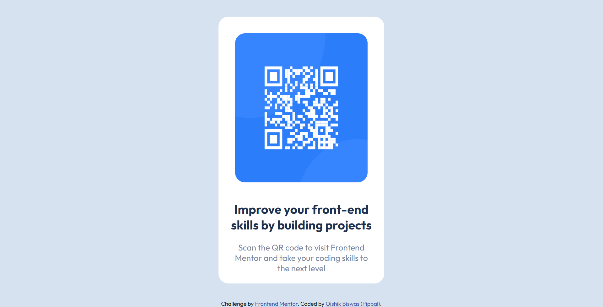

# Frontend Mentor - QR code component solution

This is a solution to the [QR code component challenge on Frontend Mentor](https://www.frontendmentor.io/challenges/qr-code-component-iux_sIO_H). Frontend Mentor challenges help you improve your coding skills by building realistic projects. 

## Table of contents

- [Overview](#overview)
  - [Screenshot](#screenshot)
  - [Links](#links)
- [My process](#my-process)
  - [Built with](#built-with)
- [Author](#author)

## Overview

### Screenshot

### Links

- Solution URL: [https://github.com/pippal5536/frontend-mentor-qr-code-component-main](https://github.com/pippal5536/frontend-mentor-qr-code-component-main)
- Live Site URL: [https://magical-melomakarona-d9a067.netlify.app/](https://magical-melomakarona-d9a067.netlify.app/)

## My process

### Built with

- CSS custom properties
- Flexbox
- Mobile-first workflow

## Author

- Frontend Mentor - [@pippal5536](https://frontendmentor.io/profile/pippal5536)

